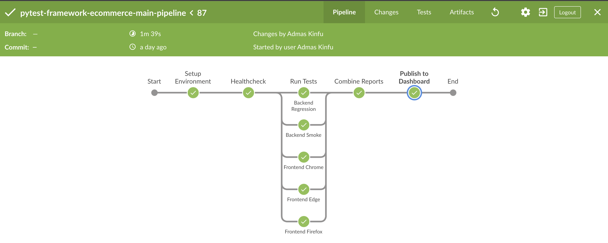
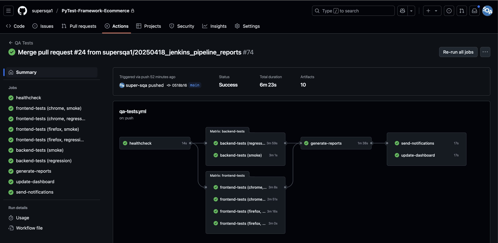
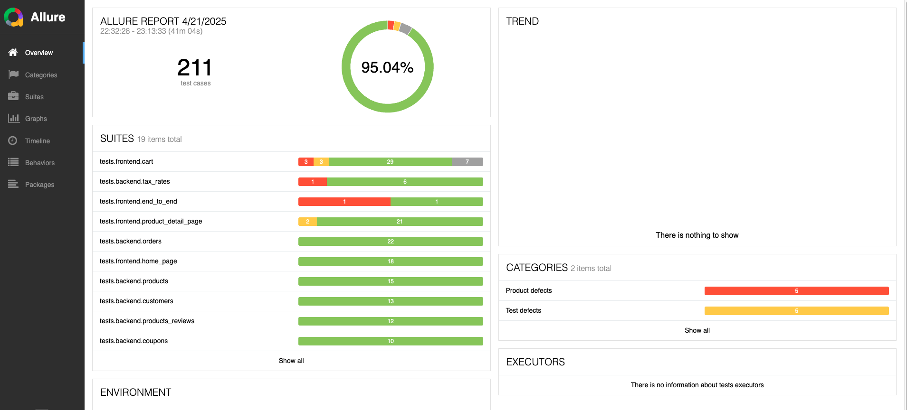
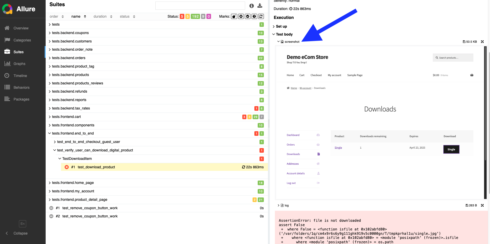
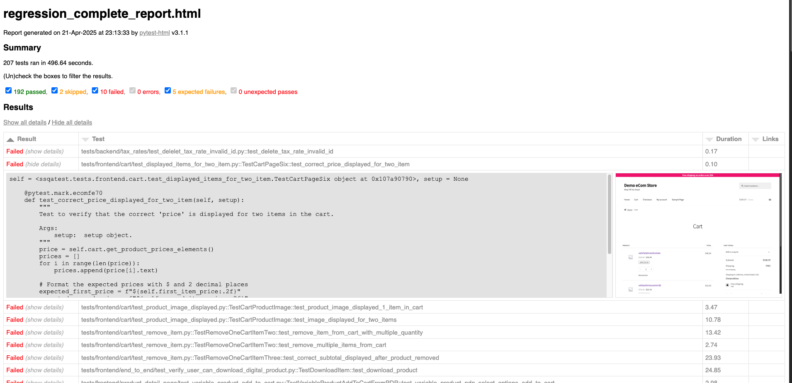
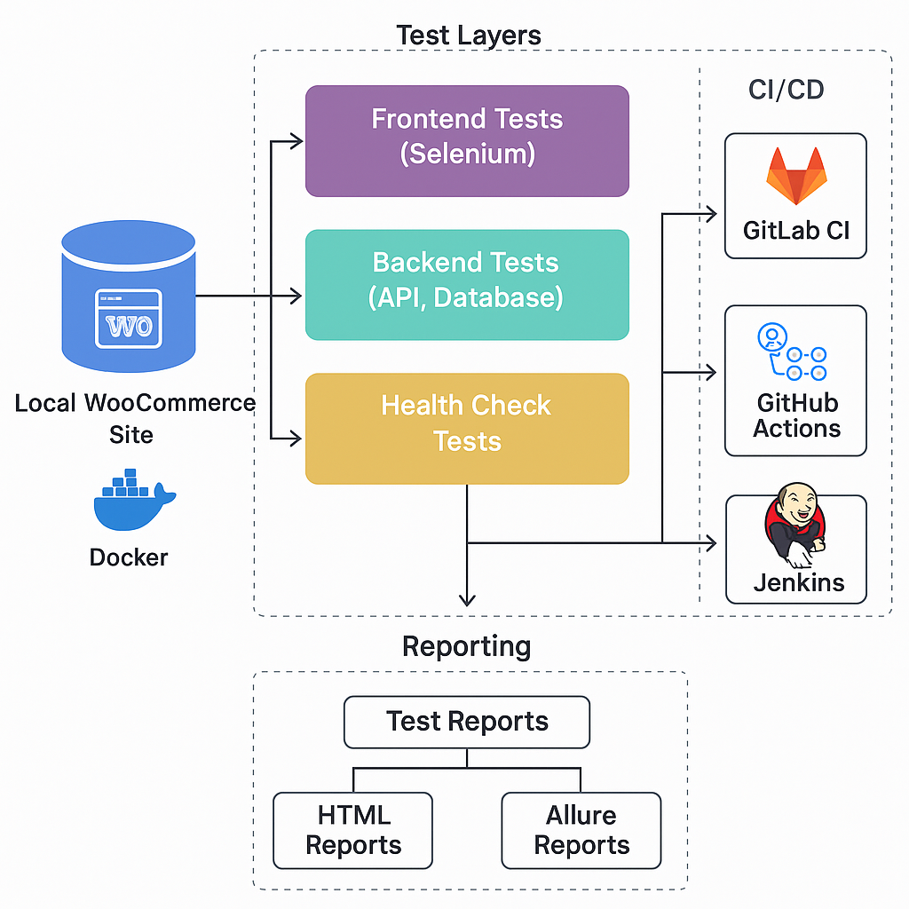

# E-commerce Site Test Framework - Base

<div align="center">
  
  
  
  
  
</div>

<div style="background-color:rgb(255, 177, 177); padding: 15px; border-radius: 5px; margin: 20px 0;">
  <p style="margin: 0; color: rgb(5, 0, 0);">Note: This is a lite version of the framework for demonstration purposes. The screenshots and features described below are from the full implementation, which contains 200+ tests and advanced features. The actual code in this repository is a simplified version with 16 basic tests. The full implementation code is available upon request for portfolio review purposes.</p>
</div>

## ✨ Highlights

- 200+ automated tests across frontend, API, and database
- Parallel execution using pytest-xdist
- CI/CD ready: GitLab CI, GitHub Actions, Jenkins
- HTML, JUnit, and Allure reporting with screenshots on failure
- Developed as part of SuperSQA QA Automation Bootcamp


## 📋 Overview
A professional-grade test automation framework designed for E-Commerce applications built with WordPress and WooCommerce. It covers frontend (using Selenium), API, and database testing using Python and PyTest, and integrates with CI/CD systems like GitLab CI, GitHub Actions, and Jenkins. Developed for the SuperSQA QA Bootcamp to simulate real-world automation workflows, reporting, and environments.

> **Example Site**: [Demo Store](http://demostore.supersqa.com/)

> **Note**: This framework is intentionally maintained in both GitHub and GitLab repositories to provide students with hands-on experience in different CI/CD environments. The same codebase is configured to work with GitHub Actions, Jenkins, and GitLab CI, offering comprehensive exposure to modern CI/CD practices.


### 🎯 Key Features
- **Comprehensive Test Coverage**: 200+ tests covering frontend, backend, and database layers
- **Advanced Reporting**: 
  - HTML reports with detailed test execution information
  - Allure reports with beautiful dashboards and analytics
  - Automatic screenshot capture on test failures
- **CI/CD Integration**: 
  - GitLab CI pipeline configuration
  - Jenkins pipeline setup
  - GitHub Actions workflow
- **Parallel Execution**: Optimized test execution across multiple workers
- **End-to-End Testing**: Comprehensive test coverage for both frontend and backend
- **API Testing**: Robust API test suite for WooCommerce endpoints
- **Database Testing**: Integration with MySQL for data validation
- **Cross-Browser Support**: Test execution across multiple browsers
- **Docker Support**: Containerized test execution environment

## 📸 Project Screenshots

### CI/CD Pipelines
<div align="center">
  
  <p><em>GitLab CI pipeline showing parallel test execution and stages</em></p>
  
  
  <p><em>Jenkins pipeline running tests and publishing reports</em></p>
  
  
  <p><em>GitHub Actions workflow execution</em></p>
</div>

### Test Reports
<div align="center">
  
  <p><em>HTML test report with detailed execution information</em></p>
  
  
  <p><em>Allure Report Dashboard showing test execution overview</em></p>
  
  
  <p><em>Automatically captured screenshot on test failure (Allure)</em></p>

  
  <p><em>Automatically captured screenshot on test failure (pytest-html)</em></p>
</div>


## 🛠️ Technical Stack
- **Programming Language**: Python 3.13+
- **Testing Framework**: PyTest
- **Web Automation**: Selenium WebDriver
- **API Testing**: Requests library
- **Database**: MySQL
- **Containerization**: Docker
- **CI/CD**: GitLab CI, Jenkins, GitHub Actions
- **Parallel Testing**: pytest-xdist

## 🧱 Architecture Overview

The framework follows a modular architecture with a clear separation between test layers and utility logic. Tests are structured using the Page Object Model for frontend coverage, helper modules for API and database testing, and configuration files to support multiple environments.

The automation flow involves:
- Selenium-based UI tests interacting with a live WooCommerce frontend
- REST API tests targeting WooCommerce endpoints
- MySQL integration to verify backend data consistency
- CI/CD pipelines (Jenkins, GitLab CI, GitHub Actions) automatically triggering tests and publishing reports
- Allure and HTML reporting for detailed visibility

<p align="center">
  
  <br><em>Overall architecture showing test layers, CI triggers, and reporting flow</em>
</p>


## 🚀 Getting Started

### Prerequisites
- Python 3.13 or higher
- Docker (optional, for containerized execution)
- Access to a WordPress + WooCommerce site with StoreFront theme
- MySQL database access

### Setting Up Your Local Testing Environment
To get the most out of this framework, users can set up their own local WordPress + WooCommerce site for testing. This provides complete control over the test environment and allows for safe experimentation.

#### Written Tutorial
Follow the comprehensive written guide to set up a local testing environment:
[Setting Up WordPress & WooCommerce for Testing](https://www.supersqa.com/setup-wordpress-woocommerce-testing-site)

#### Video Tutorial Series
Watch the step-by-step video series:

1. [Part 1: Installing WordPress](https://www.youtube.com/watch?v=KhLGXIxeJLI)
2. [Part 2: Configuring The Site](https://www.youtube.com/watch?v=w47JR3aoTNw)
3. [Part 3: Verifying API and Frontend Checkout](https://www.youtube.com/watch?v=qwCY8UEWqqM)

These resources guide users through:
- Setting up a local development environment
- Installing and configuring WordPress
- Setting up WooCommerce
- Creating test products and categories
- Setting up API keys for testing
- Verifying the checkout process

### Quick Start
1. Clone the repository (choose one based on your preferred CI/CD platform):
```bash
# For GitHub
git clone https://github.com/supersqa1/qa-bootcamp-framework.git

# For GitLab
git clone git@gitlab.com:ssqagroup1/qa-bootcamp-framework.git

cd qa-bootcamp-framework
```

> **Note**: The same codebase is maintained in both GitHub and GitLab to provide hands-on experience with different CI/CD platforms. Choose the repository that aligns with your learning goals:
> - GitHub repository for GitHub Actions
> - GitLab repository for GitLab CI
> - Either repository can be used with Jenkins CI

2. Set up virtual environment and install dependencies:
```bash
python3 -m venv venv
source venv/bin/activate  # On Windows: venv\Scripts\activate
pip install -r requirements.txt
```

3. Configure environment variables (see Configuration section below)

4. Run tests:
```bash
cd ssqatest
python3 -m pytest tests
```

## ⚙️ Configuration
The framework uses environment variables for configuration. Create a `variables_local.sh` (Linux/Mac) or `variables_local.bat` (Windows) file with the following variables:

```bash
export BASE_URL=<your_website_url>
export BROWSER=<browser_name>  # chrome, firefox, headlesschrome,...
export RESULTS_DIR=$(pwd)/results
export DB_PORT=<your_database_port>
export DB_HOST=<your_database_host>
export DB_DATABASE=<your_database_name>
export DB_TABLE_PREFIX=<table_prefix>  # typically wp_ for WordPress
export WOO_KEY=<your_woocommerce_key>
export WOO_SECRET=<your_woocommerce_secret>
export DB_USER=<your_db_user>
export DB_PASSWORD=<your_db_password>
```

## 🔄 Parallel Test Execution

### Overview
The framework uses pytest-xdist for parallel test execution, providing significant speed improvements for large test suites. Tests are distributed across multiple workers, with each worker running its own browser instance.

### Configuration
Parallel execution is configured in `pytest.ini` with the following settings:
```ini
addopts = -n auto --dist=loadscope
```
- `-n auto`: Automatically determines the optimal number of workers based on CPU cores
- `--dist=loadscope`: Groups tests by module/class to maintain test isolation

### Running Tests

#### Parallel Execution (Default)
```bash
# Run all tests in parallel
pytest tests/

# Run specific test directory in parallel
pytest tests/frontend/

# Run with specific number of workers
pytest -n 4 tests/
```

#### Sequential Execution
```bash
# Run tests sequentially
pytest -n 0 tests/

# Run specific test file sequentially
pytest -n 0 tests/frontend/test_login.py

# Run tests by marker
pytest -n 0 -m smoke tests/  # Run all tests marked with @pytest.mark.smoke
pytest -n 0 -m "not smoke" tests/  # Run all tests not marked with @pytest.mark.smoke
```

### Test Distribution Strategy
- Tests are grouped by module/class using `--dist=loadscope`
- This ensures related tests run on the same worker
- Each worker gets its own browser instance and profile
- Browser profiles are stored in `/tmp/` with worker-specific identifiers

### Best Practices
1. **Test Isolation**: Ensure tests are properly isolated and don't share state
2. **Resource Management**: Monitor system resources when running in parallel
3. **Debugging**: Use `-n 0` for easier debugging of specific tests
4. **CI/CD**: Parallel execution is ideal for CI/CD pipelines to reduce execution time

## 📄 Test Structure

This project separates test code and supporting logic into two main folders:
- `ssqatest/`: Contains all tests (frontend, backend, health checks)
- `src/`: Contains reusable modules such as page objects, API utilities, data access, and custom Selenium extensions

This separation helps maintain clean architecture and enables easier reuse of logic across test suites.

```
ssqatest/
├── tests/
│   ├── frontend/     # UI automation tests
│   ├── backend/      # API and database tests
│   └── test_healthcheck.py  # Health check tests
├── src/
│   ├── pages/        # Page object models
│   ├── api_helpers/  # API helper functions
│   ├── generic_helpers/  # Generic helper functions
│   ├── selenium_extended/  # Extended Selenium functionality
│   ├── configs/      # Configuration files
│   ├── dao/          # Data Access Objects
│   ├── utilities/    # Utility functions
│   └── data/         # Test data
├── scripts/          # Utility scripts
├── pytest.ini        # pytest configuration
└── conftest.py       # pytest fixtures and hooks
```

## 📊 Test Execution
- Run all tests: `python3 -m pytest tests`
- Run frontend tests: `python3 -m pytest tests/frontend`
- Run backend tests: `python3 -m pytest tests/backend`
- Run specific test: `python3 -m pytest tests -m tcid33`

## 📊 Test Reports
The framework supports three types of test reports, each with its own advantages:

### 1. HTML Reports (Simple and Quick)
HTML reports provide a straightforward way to view test results with basic information about test execution.

#### Generating HTML Reports
```bash
# Run tests with HTML report generation
cd ssqatest
python3 -m pytest tests --html=reports/report.html

# View the report
open reports/report.html  # On Mac
# or
start reports/report.html  # On Windows
```

HTML reports include:
- Test execution status (passed/failed)
- Test duration
- Error messages for failed tests
- Basic test information
- Screenshot of page if a test fails

### 2. JUnit XML Reports (CI/CD Integration)
JUnit XML reports are particularly useful for CI/CD integration and test result analysis in various tools.

#### Generating JUnit Reports
```bash
# Run tests with JUnit XML report generation
cd ssqatest
python3 -m pytest tests --junitxml=reports/junit.xml
```

JUnit reports are used by:
- Jenkins for test result visualization and trend analysis
- GitLab CI for test result parsing and reporting
- GitHub Actions for test result integration
- Various test result visualization tools
- Test result aggregation platforms

### 3. Allure Reports (Advanced and Beautiful)
Allure reports provide a more sophisticated and visually appealing way to analyze test results, with detailed information and analytics.

#### Generating and Viewing Allure Reports
The process involves three sequential steps:

1. First, run tests and collect Allure results:
```